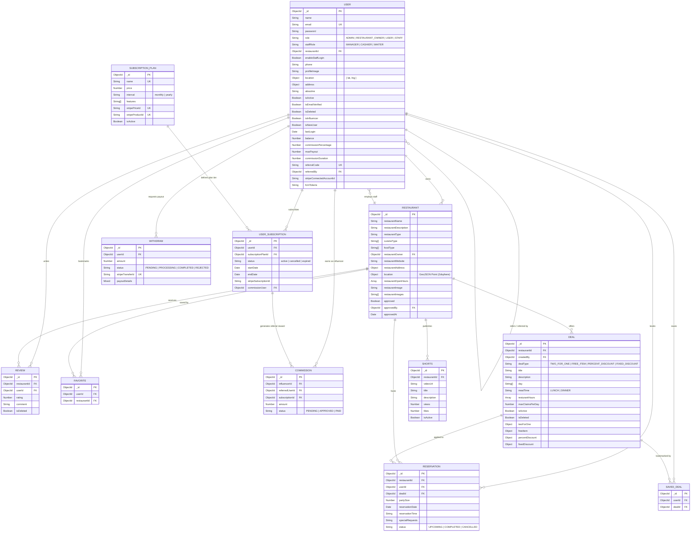

# VIBEZ Backend API

Vibez Backend is a robust, modular, and high-performance backend application built with **Node.js**, **Express**, and **TypeScript**. It serves as the core API service for the VIBEZ application, supporting role-based access control, restaurant management, table reservations, promotional deals, Stripe payment integration, real-time communications via Socket.io, Google Maps location integration, and push notifications.

---

## 🚀 Tech Stack & Core Libraries

- **Runtime & Language**: Node.js, TypeScript (`ts-node-dev` for development, `tsc` for compilation)
- **Framework**: Express.js
- **Database**: MongoDB (Object modeling via Mongoose)
- **Authentication**: JSON Web Tokens (JWT), Bcrypt hashing
- **Payments**: Stripe (Checkout & Webhooks)
- **Maps & Location**: Google Maps API
- **File Processing**: Multer (file uploads) & Sharp (image optimization/resizing)
- **Emailing**: Nodemailer (SMTP/Gmail integrations)
- **Validation**: Zod (schema validations)
- **Notifications & Push**: Firebase Cloud Messaging (FCM via `firebase-admin`)
- **Real-Time & Background**: Socket.io (real-time communication), Node-Cron (scheduled cron tasks), BullMQ & ioredis (background queue processing)

---

## 📁 Project Structure

The codebase is organized following a **Modular Pattern**, where each feature is self-contained with its route, controller, service, model, and interface.

```text
vibez_backend/
├── src/
│   ├── app/
│   │   ├── config/                   # Centralized Environment Configuration
│   │   ├── modules/                  # Modular domain-driven folders
│   │   │   ├── auth/                 # Users & Authentication
│   │   │   ├── commission/           # Referral commission logic
│   │   │   ├── coupon/               # Coupon management
│   │   │   ├── deal/                 # Promotional Deals
│   │   │   ├── faq/                  # Frequently Asked Questions
│   │   │   ├── favorite/             # User Favorites
│   │   │   ├── notification/         # FCM Push Notifications
│   │   │   ├── promocodes/           # Coupon & Promo Codes
│   │   │   ├── public/               # Public assets / endpoints
│   │   │   ├── reservation/          # Restaurant table bookings
│   │   │   ├── restaurant/           # Restaurant profiles & menus
│   │   │   ├── review/               # Customer feedback & ratings
│   │   │   ├── saved-deal/           # Saved/Bookmarked deals
│   │   │   ├── settings/             # System settings & configuration
│   │   │   ├── shorts/               # Short video reels/clips
│   │   │   ├── stripe/               # Stripe integration & webhooks
│   │   │   ├── subscription/         # Platform subscription tiers
│   │   │   ├── user/                 # Admin User Management
│   │   │   ├── usersubscription/     # Subscribed user plans
│   │   │   └── withdraw/             # Commission payouts
│   │   └── routes/                   # API Route Registry
│   ├── errors/                       # Global error handling utilities
│   ├── utils/                        # Helper functions (catchAsync, sendResponse, etc.)
│   ├── app.ts                        # Express App definition & middlewares
│   └── server.ts                     # Database connection & Server listener
├── public/                           # Static assets
├── uploads/                          # User-uploaded files
├── .env.example                      # Template for environment variables
├── package.json                      # Project dependencies & scripts
└── tsconfig.json                     # TypeScript compiler configuration
```

---

## 🛠️ Getting Started

### Prerequisites

Ensure you have the following installed on your machine:
- **Node.js** (v18+ recommended)
- **npm** or **yarn**
- **MongoDB** (local instance or MongoDB Atlas cluster URI)
- **Redis** (optional, required if running background workers/BullMQ)

### Installation & Setup

1. **Clone the repository and navigate into the project directory**:
   ```bash
   git clone <repository-url>
   cd vibez_backend
   ```

2. **Install project dependencies**:
   ```bash
   npm install
   ```

3. **Configure Environment Variables (`.env`)**:
   - Create a `.env` file in the project root directory by copying the sample template:
     ```bash
     cp .env.example .env
     ```
   - Open `.env` and fill in your MongoDB connection string, JWT secrets, SMTP credentials, Stripe keys, and initial admin credentials.

---

## ⚙️ Environment Variables Guide

Copy the template below into your `.env` file and replace values:

```env
# Application Setup
NODE_ENV=development
IP=0.0.0.0
PORT=5000

# Database Connection
MONGODB_URL=mongodb+srv://<USER>:<PASS>@cluster.mongodb.net/vibez?retryWrites=true&w=majority

# Security Settings
BCRYPT_SALT_ROUNDS=12

# Client URLs
CLIENT_URL=http://localhost:3000

# JWT Configuration
JWT_ACCESS_SECRET=your_access_secret
JWT_ACCESS_EXPIRE=30d
JWT_REFRESH_SECRET=your_refresh_secret
JWT_REFRESH_EXPIRE=365d
JWT_PASSWORD_RESET_SECRET=your_password_reset_secret

# Nodemailer / SMTP Email Setup
SMTP_HOST=smtp.gmail.com
SMTP_PORT=587
SMTP_SECURE=false
SMTP_USER=example@gmail.com
SMTP_PASS="your_app_password"

# Initial Admin Seeding Configuration
INITIAL_ADMIN_NAME="Appon Islam"
INITIAL_ADMIN_EMAIL=admin@vibez.com
INITIAL_ADMIN_PASSWORD=your_secure_password
INITIAL_ADMIN_PHONE=+8801700000000

# Stripe Payment Gateway
STRIPE_PUBLISHABLE_KEY=pk_test_...
STRIPE_SECRET_KEY=sk_test_...
STRIPE_WEBHOOK_SECRET=whsec_...

# Google Maps API
MAPS_API_KEY=AIzaSy...
```

### Environment Variable References

| Variable | Description | Default / Example |
| :--- | :--- | :--- |
| `NODE_ENV` | Running Environment Mode | `development` |
| `IP` | Bind IP Address | `0.0.0.0` |
| `PORT` | Server Listening Port | `5000` |
| `MONGODB_URL` | MongoDB Connection URI | `mongodb+srv://...` |
| `BCRYPT_SALT_ROUNDS` | Salt cost factor for password hashing | `12` |
| `CLIENT_URL` | Frontend Web Client URL (used for email verification links & Stripe checkout callbacks) | `https://vibez.apponislam.top` |
| `JWT_ACCESS_SECRET` | Secret key for signing Access Tokens | `your_access_secret` |
| `JWT_ACCESS_EXPIRE` | Expiry duration for Access Tokens | `30d` |
| `JWT_REFRESH_SECRET` | Secret key for signing Refresh Tokens | `your_refresh_secret` |
| `JWT_REFRESH_EXPIRE` | Expiry duration for Refresh Tokens | `365d` |
| `JWT_PASSWORD_RESET_SECRET` | Secret key for Password Reset OTP tokens | `your_reset_secret` |
| `SMTP_HOST` | Email SMTP Server Host | `smtp.gmail.com` |
| `SMTP_PORT` | Email SMTP Server Port | `587` |
| `SMTP_SECURE` | Secure connection flag | `false` |
| `SMTP_USER` | System sender email address | `example@gmail.com` |
| `SMTP_PASS` | SMTP / Gmail App Password | `your_app_password` |
| `INITIAL_ADMIN_NAME` | Name of auto-seeded Super Admin | `Appon Islam` |
| `INITIAL_ADMIN_EMAIL` | Email of auto-seeded Super Admin | `admin@vibez.com` |
| `INITIAL_ADMIN_PASSWORD` | Password of auto-seeded Super Admin | `your_password` |
| `INITIAL_ADMIN_PHONE` | Phone of auto-seeded Super Admin | `+8801700000000` |
| `STRIPE_PUBLISHABLE_KEY` | Stripe Publishable API Key | `pk_test_...` |
| `STRIPE_SECRET_KEY` | Stripe Secret API Key | `sk_test_...` |
| `STRIPE_WEBHOOK_SECRET` | Stripe Webhook Signature Secret | `whsec_...` |
| `MAPS_API_KEY` | Google Maps Platform API Key | `AIzaSy...` |

---


## 🏃 Scripts

| Command | Action |
| :--- | :--- |
| `npm run dev` | Runs the server in development mode with auto-reload (using `ts-node-dev`) |
| `npm run build` | Compiles the TypeScript code to standard JavaScript in the `dist/` directory |
| `npm run start` | Runs the compiled JavaScript server in production mode |
| `npm run lint` | Lints the codebase using ESLint rules |
| `npm run lint:fix` | Automatically resolves autofixable linting issues |

---

## 🛰️ API Routes Reference

All API routes are prefixed with `/api/v1`.

### 🔑 Authentication (`/api/v1/auth`)
- `POST /auth/register` - Register a new user
- `POST /auth/login` - Authenticate user & get tokens
- `POST /auth/refresh-token` - Retrieve a new access token using refresh token
- `POST /auth/change-password` - Update account password (authenticated)
- `POST /auth/forgot-password` - Request a password reset OTP
- `POST /auth/verify-otp` - Verify the password reset OTP
- `POST /auth/reset-password` - Reset password with verified token

### 🍕 Restaurants (`/api/v1/restaurants`)
- `GET /restaurants` - Retrieve approved restaurant list (supports search, geolocation, filters)
- `GET /restaurants/admin/all` - Retrieve all restaurants (Admin only, includes unapproved ones)
- `POST /restaurants` - Create restaurant profile (Admin/Owner; auto-approves if allowed by settings)
- `GET /restaurants/:id` - Fetch details of a specific restaurant
- `PATCH /restaurants/:id` - Update restaurant info
- `DELETE /restaurants/:id` - Soft-delete restaurant (Admin/Owner)
- `PATCH /restaurants/:id/approve` - Approve a restaurant profile (Admin only)
- `PATCH /restaurants/:id/revoke-approval` - Revoke restaurant approval (Admin only)

### 👥 User & Staff Administration (`/api/v1/users`)
- `GET /users` - Paginated user listing with support for search and filtering by role/influencer/active status (Admin only)
- `GET /users/stats` - Fetch platform usage statistics: total, regular, influencer, and premium users (Admin only)
- `GET /users/:id/activity` - Detailed chronological view of referrals, subscriptions, commissions, and withdrawals (Admin only)
- `PATCH /users/:id/edit` - Modify user's influencer status and customized commission terms (Admin only)
- `PATCH /users/:id/toggle-status` - Toggle a user's active/banned status (Admin only)
- `POST /users/staff` - Create a new staff account (Manager/Cashier/Waiter) with optional profile image upload (Owner/Admin)
- `GET /users/staff` - Paginated listing of all staff members registered under the owner's restaurant (Owner/Admin)
- `PATCH /users/staff/:staffId/toggle-login` - Enable or disable login permission for a specific staff member (Owner/Admin)
- `PATCH /users/staff/toggle-all-login` - Enable or disable login permission for all staff members of the restaurant simultaneously (Owner/Admin)

### 🏷️ Deals & Promotions (`/api/v1/deals`)
- `GET /deals` - Retrieve all active deals (pass `?restaurantId=ID` to filter by restaurant)
- `GET /deals/:dealId` - Get individual deal information
- `POST /deals` - Create a new deal (Admin/Owner)
- `PATCH /deals/:dealId` - Update deal details
- `PATCH /deals/:dealId/toggle-status` - Toggle active/inactive status (Admin)
- `DELETE /deals/:dealId` - Remove deal

### 📅 Reservations (`/api/v1/reservations`)
- `POST /reservations` - Book a table
- `GET /reservations` - Get booking list (filters apply based on roles)
- `PATCH /reservations/:id/status` - Update reservation status (Pending/Confirmed/Cancelled)

### 💳 Subscriptions & Payments (`/api/v1/subscriptions`)
- `GET /subscriptions` - Get active subscription tiers
- `POST /subscriptions/checkout` - Create payment gateway session
- `POST /subscription/webhook` - Stripe payment webhooks receiver (handles updates)

### 🎥 Shorts (`/api/v1/shorts`)
- `GET /shorts` - Retrieve video feeds
- `POST /shorts` - Upload a new short video clip

---

## 🗄️ Database Relationships & Schemas Analysis

Below is an overview of the core database schema models and how they relate:



---

## 📋 Line-by-Line Model & Field Specification

- **User Model (`UserModel`)**
  - `_id`: `ObjectId` - Unique identifier for the user account.
  - `name`: `String` - Full name of the user.
  - `email`: `String` - Unique email address used for authentication.
  - `password`: `String` - Encrypted password hash (Bcrypt).
  - `role`: `String` - System role (`ADMIN`, `RESTAURANT_OWNER`, `USER`, `STAFF`).
  - `staffRole`: `String` - Role assignment for staff (`MANAGER`, `CASHIER`, `WAITER`).
  - `restaurantId`: `ObjectId` - References `Restaurant` model if user is staff/owner.
  - `enableStaffLogin`: `Boolean` - Controls staff login access permissions.
  - `phone`: `String` - Contact phone number.
  - `profileImage`: `String` - Profile picture image file path / URL.
  - `location`: `{ lat: Number, lng: Number }` - Latitude and longitude coordinates.
  - `address`: `{ street, city, state, zipCode, country }` - User physical location details.
  - `aboutme`: `String` - User bio/description.
  - `isActive`: `Boolean` - Account active status flag.
  - `isEmailVerified`: `Boolean` - Indicates whether email verification is completed.
  - `isDeleted`: `Boolean` - Soft deletion flag.
  - `isInfluencer`: `Boolean` - Identifies registered platform influencers.
  - `isNewUser`: `Boolean` - Onboarding status flag.
  - `lastLogin`: `Date` - Timestamp of latest account login.
  - `balance`: `Number` - Referral & commission wallet balance.
  - `commissionPercentage`: `Number` - Custom commission rate override (%).
  - `maxPayout`: `Number` - Maximum earning cap limit.
  - `commissionDuration`: `Number` - Duration limit for referral payouts (days).
  - `favoriteCuisines`: `[String]` - List of user's preferred food types.
  - `dietaryPreferences`: `[String]` - Dietary restriction tags.
  - `referralCode`: `String` - Unique 8-character referral code generated on register.
  - `referredBy`: `ObjectId` - References `User` model who invited this user.
  - `stripeConnectedAccountId`: `String` - Connected Stripe account ID for payouts.
  - `fcmTokens`: `[String]` - Firebase FCM tokens for push notification delivery.
  - `createdAt` / `updatedAt`: `Date` - Mongoose automatic timestamps.

- **Restaurant Model (`RestaurantModel`)**
  - `_id`: `ObjectId` - Unique identifier for the restaurant.
  - `restaurantName`: `String` - Official name of the restaurant.
  - `restaurantDescription`: `String` - Overview and details of the restaurant.
  - `restaurantType`: `String` - Enum category (e.g. Fine Dining, Fast Food, Cafe).
  - `cuisineType`: `[String]` - List of cuisine types offered.
  - `foodType`: `[String]` - Specific dietary or item classifications.
  - `restaurantOwner`: `ObjectId` - References `User` model (owner account).
  - `restaurantWebsite`: `String` - Official website URL.
  - `restaurantAddress`: `{ street, city, state, zipCode, country, location }` - Detailed physical address.
  - `restaurantAddress.location`: `GeoJSON Point { type: "Point", coordinates: [lng, lat] }` - Indexed with `2dsphere` for distance queries.
  - `restaurantOpenHours`: `[{ day, isOpen, slots: [{ type, openTime, closeTime }] }]` - Operating schedule.
  - `restaurantImage`: `String` - Main cover image URL.
  - `restaurantImages`: `[String]` - Gallery photo URLs.
  - `approved`: `Boolean` - Admin approval verification status.
  - `approvedBy`: `ObjectId` - References `User` model (admin who approved).
  - `approvedAt`: `Date` - Timestamp when profile was approved.
  - `createdAt` / `updatedAt`: `Date` - Mongoose automatic timestamps.

- **Deal Model (`DealModel`)**
  - `_id`: `ObjectId` - Unique identifier for the promotional offer.
  - `restaurantId`: `ObjectId` - References `Restaurant` model hosting the deal.
  - `createdBy`: `ObjectId` - References `User` model who posted the deal.
  - `dealType`: `String` - Type of deal (`TWO_FOR_ONE`, `FREE_ITEM`, `PERCENT_DISCOUNT`, `FIXED_DISCOUNT`).
  - `title`: `String` - Title of the deal.
  - `description`: `String` - Specific terms / details of the deal.
  - `day`: `[String]` - Applicable days of the week.
  - `mealTime`: `String` - Meal timeframe category (`LUNCH`, `DINNER`).
  - `resturantHours`: `[{ day, start, end }]` - Deal active time windows per day.
  - `maxClaimsPerDay`: `Number` - Maximum allowable daily redemptions.
  - `isActive`: `Boolean` - Deal status toggle.
  - `isDeleted`: `Boolean` - Soft deletion flag.
  - `twoForOne`: `{ appliesTo }` - Rules if deal is 2-for-1.
  - `freeItem`: `{ buy, get }` - Rules if deal is Buy X Get Y Free.
  - `percentDiscount`: `{ percentage, appliesTo, category }` - Percentage discount breakdown.
  - `fixedDiscount`: `{ minSpend, amount }` - Flat discount breakdown.
  - `createdAt` / `updatedAt`: `Date` - Mongoose automatic timestamps.

- **Reservation Model (`ReservationModel`)**
  - `_id`: `ObjectId` - Unique identifier for the reservation.
  - `restaurantId`: `ObjectId` - References `Restaurant` model.
  - `userId`: `ObjectId` - References `User` model (customer).
  - `dealId`: `ObjectId` - References `Deal` model attached to table booking.
  - `partySize`: `Number` - Total guest headcount.
  - `reservationDate`: `Date` - Date of table reservation.
  - `reservationTime`: `String` - Time slot string (e.g. `"19:30"`).
  - `specialRequests`: `String` - Customer notes or dietary requests.
  - `status`: `String` - Booking status (`UPCOMING`, `COMPLETED`, `CANCELLED`).
  - `createdAt` / `updatedAt`: `Date` - Mongoose automatic timestamps.

- **Subscription Plan Model (`SubscriptionPlanModel`)**
  - `_id`: `ObjectId` - Unique identifier for the subscription plan tier.
  - `name`: `String` - Plan name (e.g. Premium Member).
  - `price`: `Number` - Price amount.
  - `interval`: `String` - Billing period (`monthly`, `yearly`).
  - `features`: `[String]` - List of included subscription perks.
  - `stripePriceId`: `String` - Stripe API Price reference ID.
  - `stripeProductId`: `String` - Stripe API Product reference ID.
  - `isActive`: `Boolean` - Plan active status.

- **User Subscription Model (`UserSubscriptionModel`)**
  - `_id`: `ObjectId` - Unique identifier for user's active membership.
  - `userId`: `ObjectId` - References `User` model.
  - `subscriptionPlanId`: `ObjectId` - References `SubscriptionPlan` model.
  - `status`: `String` - Subscription state (`active`, `cancelled`, `expired`).
  - `startDate`: `Date` - Subscription start date.
  - `endDate`: `Date` - Expiry / renewal date.
  - `stripeSubscriptionId`: `String` - External Stripe subscription reference.
  - `commissionUser`: `ObjectId` - References `User` model (influencer earning referral rewards).

- **Commission Model (`CommissionModel`)**
  - `_id`: `ObjectId` - Unique commission record ID.
  - `influencerId`: `ObjectId` - References `User` model receiving reward.
  - `referredUserId`: `ObjectId` - References `User` model who bought subscription.
  - `subscriptionId`: `ObjectId` - References `UserSubscription` model.
  - `amount`: `Number` - Commission reward amount (USD).
  - `status`: `String` - Commission payout state (`PENDING`, `APPROVED`, `PAID`).

- **Withdraw Model (`WithdrawModel`)**
  - `_id`: `ObjectId` - Payout request ID.
  - `userId`: `ObjectId` - References `User` model requesting withdrawal.
  - `amount`: `Number` - Withdrawal amount.
  - `status`: `String` - Payout processing status (`PENDING`, `PROCESSING`, `COMPLETED`, `REJECTED`).
  - `stripeTransferId`: `String` - Stripe transfer batch ID.
  - `payoutDetails`: `Mixed` - Additional gateway details.

- **Shorts Model (`ShortsModel`)**
  - `_id`: `ObjectId` - Video short ID.
  - `restaurantId`: `ObjectId` - References `Restaurant` model.
  - `videoUrl`: `String` - Video media file URL.
  - `title`: `String` - Video title.
  - `description`: `String` - Video caption/description.
  - `views`: `Number` - View count.
  - `likes`: `Number` - Total likes received.
  - `isActive`: `Boolean` - Active status.

- **Review Model (`ReviewModel`)**
  - `_id`: `ObjectId` - Review ID.
  - `restaurantId`: `ObjectId` - References `Restaurant` model.
  - `userId`: `ObjectId` - References `User` model (reviewer).
  - `rating`: `Number` - Rating score (1-5 stars).
  - `comment`: `String` - Feedback review text.
  - `isDeleted`: `Boolean` - Soft deletion flag.

- **Favorite Model (`FavoriteModel`)**
  - `_id`: `ObjectId` - Unique record ID.
  - `userId`: `ObjectId` - References `User` model.
  - `restaurantId`: `ObjectId` - References `Restaurant` model saved as favorite.

- **Saved Deal Model (`SavedDealModel`)**
  - `_id`: `ObjectId` - Unique record ID.
  - `userId`: `ObjectId` - References `User` model.
  - `dealId`: `ObjectId` - References `Deal` model saved to bookmarks.

---

## 🛡️ License

This project is licensed under the MIT License. See the [LICENSE](LICENSE) file for details.


